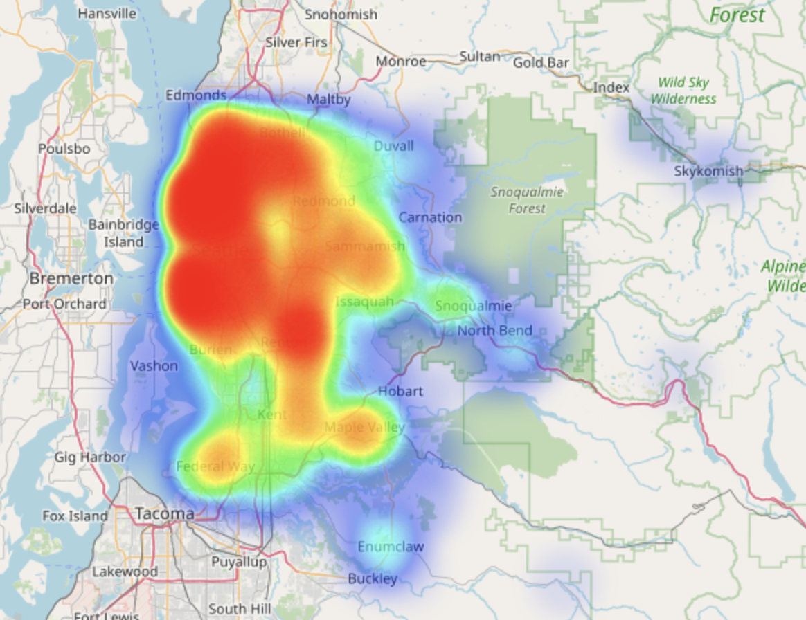
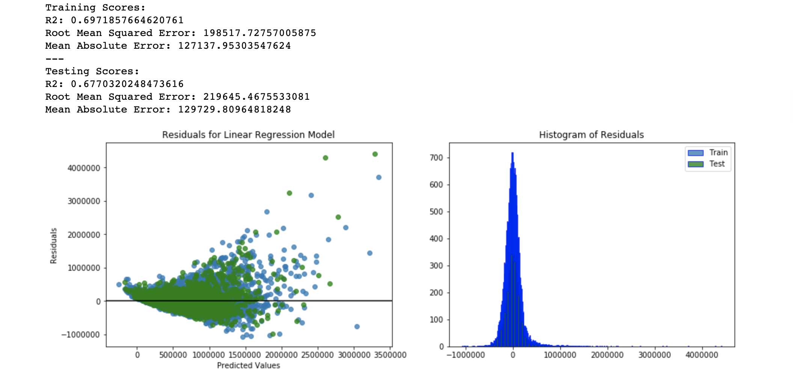
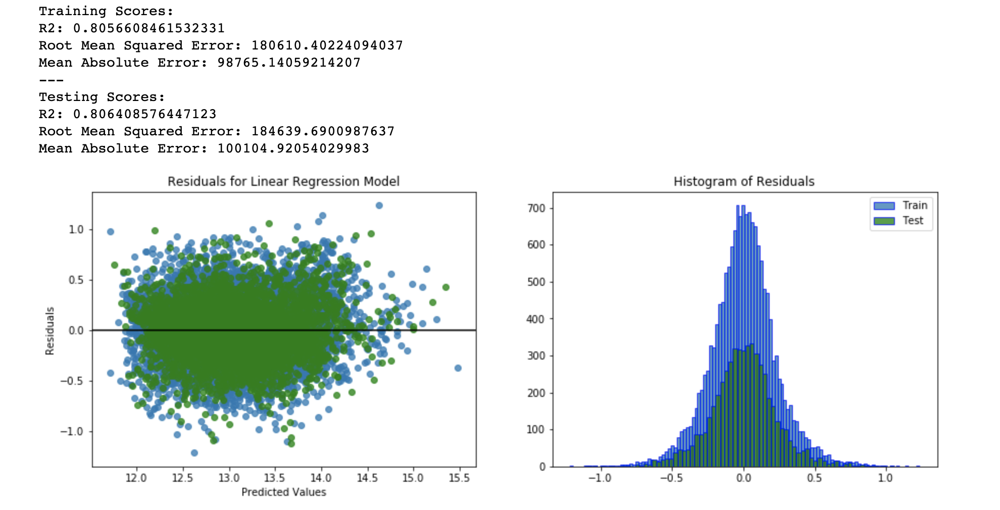
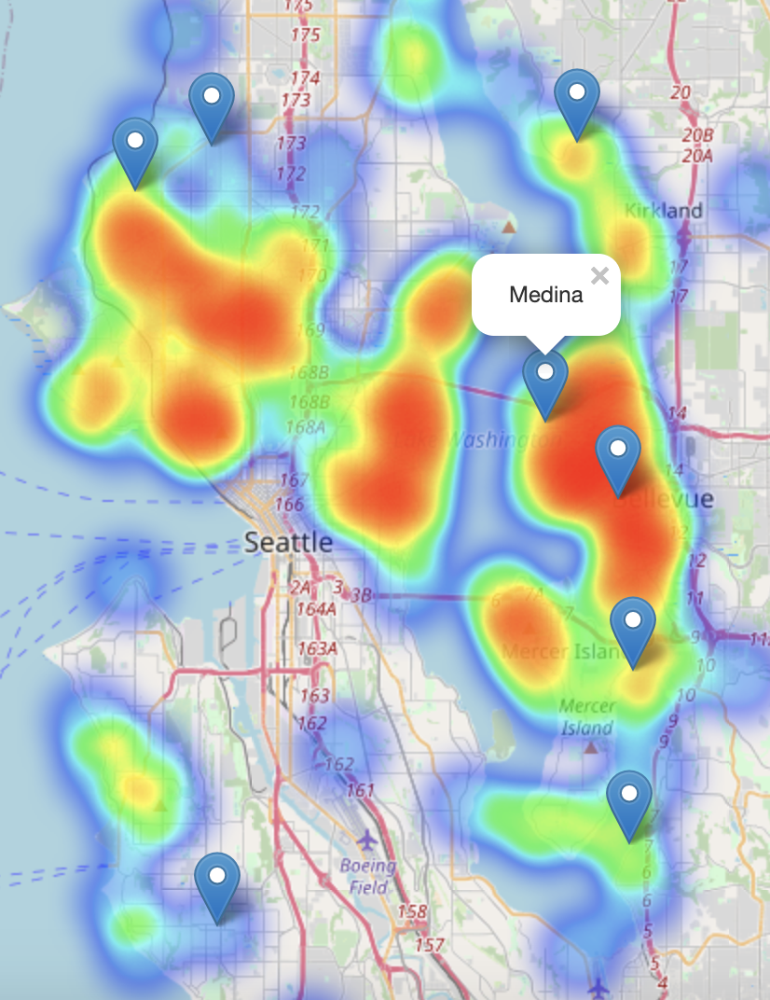

# King's County Housing Analysis

In this project I'm going to analyze the King's County housing data set listing various data points for property sales in the King's County area of Washington (centered around Seattle). I will be using Linear Regression to identify the most influential variables in maximizing sale price. For the purposes of this exercise, I will be working from the position as a consultant to a hypothetical housing developer in the Seattle area. I will be using the OSEMN (Obtain, Scrub, Explore, Model, Interpret) Data Science process in this project.

## The Business Problem

The King's County data shows various metrics for houses that sold to homebuyers in 2014 and 2015. As a consultant, my task is to identify the greatest factors that increase the sale price of homes so the developer can maximize sale price of their new housing construction projects. Such factors might include: where to build the new homes, how much land they should have, the overall quality of the construction, the size of the home, etc.

## The OSMEN Process

For this project, I will follow the OSEMN process of data science inquiry. It is split into five stages which include:

1. Obtain
2. Scrub
3. Explore
4. Model
5. Interpret

For step one, Obtain, I've been provided the data, but for scrubbing and exploring the data, I have my analysis below:

## The Data

The raw housing data contains the following columns:

- **Id** - The index of house in the data set
- **Date** - The date of the house's sale
- **Price** - The final price of the home at the time of sale
- **Bedrooms** - The number of bedrooms in the house
- **Bathrooms** - The number of bathrooms in the house (a decimal to account for toilet-only bathrooms etc.)
- **sqft_living** - The square footage of the living area
- **sqft_lot** - The size of building's plot of land
- **Floors** - The number of floors in the house (half counts for an attic)
- **Waterfront** - A binary value indicating if the house has a waterfront view.
- **View** - How many times the home was viewed before it sold
- **Condition** - The overall condition grade of the home
- **Grade** - The overall quality grade of the home
- **sqft_above** - The square footage of the home above ground
- **sqft_basement** - The square footage of the basement
- **yr_built** - The year the home was built
- **yr_renovated** - The year the home was renovated
- **zipcode** - The zipcode of the home
- **lat** - The house's latitude
- **long** - The house's longitude
- **sqft_living15** - The average square footage of the interiors of the nearest 15 neighbors
- **sqft_lot15** - The avergae square footage of the lots of the nearest 15 neighbors.

I cleaned the data and dropped any pieces of information that are either incompatible with a linear model or not applicable to the business problem.

Here is a heatmap of the data around the Seattle area:

## Baseline Model

For my baseline model, after I cleaned the columns for null and outlier values, I divided my data into continuous, categorical and outcome data, but for the purpose of this first model, categorical and continuous variables will both be treated as continuous. My outcome, price, is the success metric. Predictably, this model was poorly fit to the data. Below you can see the residuals show strong heteroscedasticity and the residuals do not follow a normal distribution:

### Analysis
As we can see the R2 score is 0.697 for the training data and 0.677 for the testing data. This means this model can account for about 68% of the testing data's variance. In practice, this means that our outcome data has an error of around $130,000, which isn't particularly helpful.

In addition to that, the test data has a worse fit than the training data, meaning that the model is slightly over-fit. We can do a lot better. From the residuals plots, we can see the data has strong heteroscedasticity, due to the 'funnel' shape of the residuals scatter plot. Lastly, the histogram has strong skew and kurtosis.

## Process

Using my baseline model as a guide, I reiterated this process with the following steps:

1. Log Transformation
2. One-Hot-Encoding Categoricals
3. Handled Variable Interactions and Correlation
4. Sorted Zipcodes by township
5. Scaled the data

My final model used a combination of every one of these alterations listed. The final model has the following residuals and R2 score:

Our final R2 score came to 0.806, meaning that it can account for 80.6% of the data's variance. Our Mean Absolute Error is around $100,000, so the model won't be able to effectively predict the final dollar amount of a property sale, but we can infer the most important factors involved in calculating the price.

## Conclusions and Interpretation

Because the data in this model are scaled, we can interpret their importance to affecting the model's output by the size of their coefficients. The following are the most influential factors in my model:

1. Square foot of living area (0.43)
2. If the proprerty is in Medina (0.214)
3. How far north the property is (0.153)
4. If the property has a waterfront view (0.148)
5. If the property is in Mercer (0.128)

In order for this hypothetical development company to maximize its housing prices, they should look to build large homes in Media or Mercer, preferably on the waterfront. This makes sense, especially if we look at a heatmap of the property sales for the top 1% of houses based on dollar cost per square foot:

Medina is, coincidentally (or probably not), the township that contains Bill Gates' mansion as well as the luxury homes of a number of other tech executives in Seattle area. It would make sense that their land is extremely costly.

## Areas of Further Study

This model has a lot of room for improvement. Several areas of exploration would be to restrict the geography to a small area of Seattle. One thing we must also account for in the real life version of this exercise, is that while scoring some development space in Medina would be incredibly profitable for a developer, since only 50 homes sold in that township in 2 years, it might not be feasible to focus the company's energy on developing property in that area, as almost all land is probably already developed. A more interesting exercise would be to identify areas of Seattle where housing prices are increasing and possibly predict which neighborhoods will be ideal for development in the future. Granted, with Seattle's history of gentrification, this has numerous political factors to consider as well.